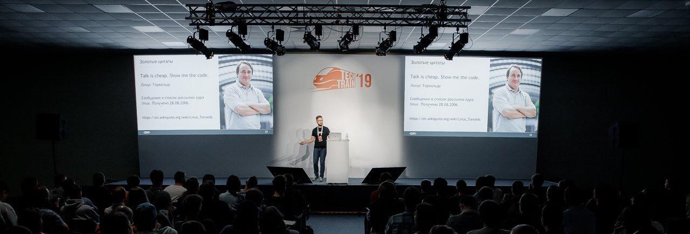

### Hi there 👋 I'm Aleksand Barmin

* 💻 I'm chief software engineer at [EPAM Systems](http://epam.com/).
* 🗞 [AWS Certified Solutions Architect – Associate](https://www.credly.com/badges/f37ba42b-3eb4-4104-8103-3c4e2400daa5).
* 🗞 [AWS Certified Developer – Associate](https://www.credly.com/badges/7f2585b8-94a9-4972-9708-7e25dd38af30).
* 🗞 [AWS Certified SysOps Administrator - Associate](https://www.credly.com/earner/earned/badge/814d0cdd-79c5-4f38-a08e-b7ef39e3f5ca).
* ☕ Most of the time I spend writing Java and JavaScript. Sometimes I write Python (not so often as I want but still).
* 🚀 I have a few pet projects which I'm growing here at GitHub.
* 🐶 I have a corgi - see my photo.
* 📫 Feel free to reach me by email [abarmin@outlook.com](mailto:abarmin@outlook.com).

### 📀 [YouTube](https://www.youtube.com/@ABarmin) shows

* 📘 [Weekly Links](./blog/weekly-links/README.md)
* 📘 [[LEET] Code with me](./blog/leet-code-with-me/README.md)

### 💼 My talks

#### 2023

* 🎬 [Cracking Technical Interviews: High-level overview of the process](https://youtu.be/0dyyFyAeB7k)
* 📻 [Java Hut #21: Двадцать одно LTS](https://pod.link/javahut/episode/70ce52b6336edd5f4ccb45f50bf60e15)
* 🎬 [Embracing predictability in software engineering](https://youtu.be/d5KbSCdvmR0)
* 🎬 [What's new in Java 21 LTS?](https://youtu.be/gxkzjaXm-Lc)
* 🎬 [Technical interview for Java Software Engineer position](https://youtu.be/zUPZCFv4epc)
* 🎬 [GraalVM & Spring Native: 3.0 version](https://youtu.be/Tm-WZ0yPxm8) - 💻 [code examples](https://github.com/aabarmin/epam-spring-native-example-2022)
* 🎬 [Design Patterns for Microservices](https://youtu.be/J9zU-KWMkK0)
* 🎬 [Design (anti-) patterns with Java and Python](https://youtu.be/_N8RGYYNnyM)

#### 2022

* 🎬 [TDD With Spring Boot: practical session](https://youtu.be/Vl20xbegWqc) - 🌆 [slides](https://github.com/aabarmin/epam-spring-boot-tdd-2022/blob/main/docs/slides.pdf) - 💻 [code examples](https://github.com/aabarmin/epam-spring-boot-tdd-2022)
* 🎬 [(Plant)UML in practice](https://youtu.be/A4vBbr87oxw) - 🌆 [slides](https://github.com/aabarmin/epam-plantuml-in-practice-2022/blob/main/slides/slides.pdf) - 💻 [code examples](https://github.com/aabarmin/epam-plantuml-in-practice-2022)
* 🎬 [Documentation as code](https://youtu.be/A4vBbr87oxw) - 🌆 [slides](https://github.com/aabarmin/epam-documentation-as-code-examples-2022/blob/main/slides/slides.pdf) - 💻 [code examples](https://github.com/aabarmin/epam-documentation-as-code-examples-2022)
* 🎬 [Spring Native: bird-eye view](https://youtu.be/FD4ksnA5zo4) - 🌆 [slides](https://github.com/aabarmin/epam-spring-native-example-2022/blob/main/slides/slides.pdf) - 💻 [code examples](https://github.com/aabarmin/epam-spring-native-example-2022)
* 🎬 [Running Spring Boot apps in AWS Elastic Beanstalk](https://youtu.be/43ZKitMqjaQ) - 🌆 [slides](./talks/2022/2022-spring-boot-in-elastic-beanstalk.pdf) - 💻 [code examples](https://github.com/aabarmin/epam-eb-example-2022)
* 🎬 [Running Spring Boot apps in AWS ECS](https://www.youtube.com/watch?v=TI0AEQYhbiA) - 🌆 [slides](./talks/2022/2022-spring-boot-in-ecs.pdf) - 💻 [code examples](https://github.com/aabarmin/epam-ecs-java-example-2022)
* 🎬 [Writing serverless app with AWS SAM - Java Version](https://youtu.be/eHqxPifJ9Xg) - 🌆 [slides](./talks/2022/2022-java-and-aws-sam.pdf) - 💻 [code examples](https://github.com/aabarmin/epam-sam-java-example-2022)

#### 2021

* 🎬 [Spring Cloud Goes Cloud](https://youtu.be/4tSyz_v9w7Q) - 🌆 [slides](https://github.com/aabarmin/aabarmin/blob/main/talks/2021/2021-spring-cloud-goes-cloud.pdf) - 💻 [code examples](https://github.com/aabarmin/epam-spring-cloud-kubernetes-2021)
* 📻 [JavaHut #16: Java снова 17](https://anchor.fm/javahut/episodes/JavaHut-16-Java--17-e17eiba)
* 🎬 [Шаблоны проектирования для микросервисов](https://youtu.be/_RCiOo4Dv8w)
* 🎬 [Building full-stack serverless app with AWS Amplify](https://youtu.be/Mm2NhBtwLng) - 💻 [code examples](https://github.com/aabarmin/corgigram)
* 🎬 [AWS SAM - Serverless Application Model](https://youtu.be/zn7Saw8u3uw) - 💻 [code examples](https://github.com/aabarmin/aws-sam-example)
* 🎬 [Spring Cloud Contract](https://youtu.be/YcDEfb8BYyE)
* 🎬 [Где взять опыт работы в IT?](https://youtu.be/QUeea4g1j1I)

#### 2020

* 🎬 [You write it with Spring - You test it with Spring](https://youtu.be/Ysh_jmEW6L0) - 🎬 [director's cut](https://youtu.be/alDo8_8f-DE) - 💻 [code examples](https://github.com/aabarmin/epam-spring-testing)
* 🎬 [Java 9 modules & OSGI](https://youtu.be/hemFuuAtdhE) - 💻 [code examples](https://github.com/aabarmin/epam-java-osgi-techtalk/branches)
* 🎬 [Q&A Карьерное развитие в EPAM](https://vk.com/videos-58536976?z=video-58536976_456239041)

#### 2019

* 🎬 Java Puzzlers
* 🎬 [Микросервисы со Spring Boot & Spring Cloud](https://youtu.be/Ts7snqxS6Zk) - 💻 [code examples](https://github.com/aabarmin/epam-dsc-2019)
* 🎬 [SOLIDный чистый код на простых примерах](https://youtu.be/WzHj_VQpdIM) - 💻 [code examples](https://github.com/aabarmin/epam-techtrain2019)

#### 2018

* 🎬 Путь в тысячу миль от монолита к микросервисам

### 📘 My articles

* 📚 [Семь советов начинающему тимлиду](https://klever.blog/tips-for-team-leaders/).
* 📚 [Использование семантической аннотации для идентификации требований](https://habr.com/en/post/126248/).
* 📚 [Управление требованиями к IT-проектам](https://habr.com/en/post/114571/).

### 🧑‍💻 [HackerRank](https://www.hackerrank.com/ABarmin) badges

### 🩹 My fancy badge area

### 🤝 To keep in touch

