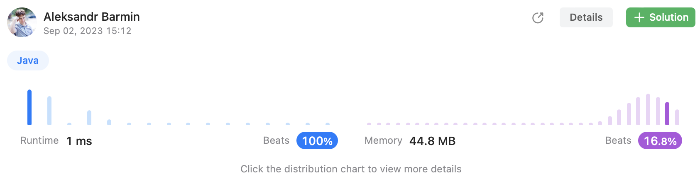

# Episode 04 - Median of Two Sorted Arrays

⬅️ [Back to index](README.md)

## The task

[Challenge on LeetCode](https://leetcode.com/problems/median-of-two-sorted-arrays/description/)

Given two sorted arrays `nums1` and `nums2` of size m and n respectively, return the median of the two sorted arrays.

The overall run time complexity should be O(log (m+n)).

Example: 

```
Input: nums1 = [1,3], nums2 = [2]
Output: 2.00000
Explanation: merged array = [1,2,3] and median is 2.
```

## Suboptimal solution

The obvious solution is create a third array, add all the elements from the original array, sort it, and finally calculate the median. The approach works by the way. 

```java
class Solution {
    public double findMedianSortedArrays(int[] nums1, int[] nums2) {
        int[] all = new int[nums1.length + nums2.length];
        System.arraycopy(nums1, 0, all, 0, nums1.length);
        System.arraycopy(nums2, 0, all, nums1.length, nums2.length);
        Arrays.sort(all);
        if (all.length == 1) {
            return all[0];
        } else if (all.length % 2 == 1) {
            return all[(all.length - 1) / 2];
        } else {
            int left = all[all.length / 2];
            int right = all[(all.length / 2) - 1];
            return (double) (left + right) / 2;
        }
    }
}
```

Unfortunately, the performance of such approach is not high that demonstrates the picture behind: 


## Optimal solution

Another option would be to iterate up to the middle element of both the arrays. If number of elements in both array is odd, it is necessary to find value of the element in the middle; if the number is even - find two values, sum them and divide by two. 

```java
class Solution {
    public double findMedianSortedArrays(int[] nums1, int[] nums2) {
        final int fullLength = nums1.length + nums2.length; 
        final boolean isOdd = fullLength % 2 == 1;
        final int lastElement = (fullLength / 2) + 1;

        int current = 0; 
        int previous = 0; 

        int index1 = 0; 
        int index2 = 0; 

        while (index1 + index2 < lastElement) {
            previous = current; 
            if (index1 < nums1.length & index2 < nums2.length) {
                if (nums1[index1] < nums2[index2]) {
                    current = nums1[index1];
                    index1++;
                } else {
                    current = nums2[index2];
                    index2++;
                }
            } else if (index1 < nums1.length) {
                current = nums1[index1];
                index1++;
            } else {
                current = nums2[index2];
                index2++;
            }
        }

        return isOdd ? 
            current : 
            (double) (current + previous) / 2;
    }
}
```

