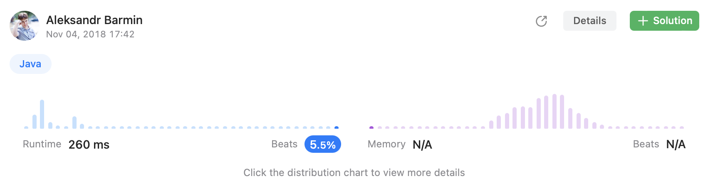
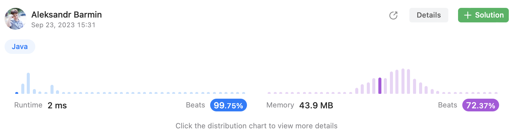

# Episode 06 - Zigzag Conversion

⬅️ [Back to index](README.md)

## The task

The string `PAYPALISHIRING` is written in a zigzag pattern on a given number of rows like this:

```
P   A   H   N
A P L S I I G
Y   I   R
```

And then read line by line: `PAHNAPLSIIGYIR`.
Write the code that will take a string and make this conversion given a number of rows.

## Suboptimal solution

The task itself looks a bit crazy just because the scenario is slightly unrealistic but still. Okay, the easiest option is to try to generate a matrix with the source string and next read it line by line. Let's give it a try. 

```java
class Solution {
    public String convert(String s, int numRows) {
        // need to determine matrix size
        int width = 0;
        if (s.length() <= numRows) {
            width = 1;
        } else if (numRows == 1) {
            return s;
        } else {
            width = ((s.length()) / (numRows + numRows - 2)) * (1 + numRows - 2);
            if (s.length() % (numRows + numRows - 2) != 0) {
                width = width + (1 + numRows - 2);
            }            
        }
        char[][] matrix = new char[width][numRows];
        // fill the matrix
        Coordinate coordinate = new Coordinate(0, 0, true);
        for (int i = 0; i < s.length(); i++) {
            matrix[coordinate.x][coordinate.y] = s.charAt(i);
            coordinate = getNext(coordinate, numRows);
        }
        StringBuilder result = new StringBuilder();
        for (int i = 0; i < numRows; i++) {
            System.out.println();
            for (int j = 0; j < width; j++) {
                if (matrix[j][i] != 0) {
                    result.append(matrix[j][i]);
                }
            }
        }
        return result.toString();
    }
    
    private Coordinate getNext(Coordinate current, int numRows) {
        boolean direction = current.direction;
        if (direction && (current.y == (numRows - 1))) {
            direction = !direction;
        }
        if (!direction && (current.y == 0)) {
            direction = !direction;
        }
        if (direction) {
            return new Coordinate(
                current.x,
                current.y + 1,
                direction
            );
        } else {
            return new Coordinate(
                current.x + 1,
                current.y - 1,
                direction
            );
        }
    }
}

class Coordinate {
    int x; 
    int y;
    boolean direction;
    
    Coordinate(int x, int y, boolean direction) {
        this.x = x;
        this.y = y;
        this.direction = direction;
    }
}
```

The approach works but still it requires to much time to process the incoming string. 



## Optimal solution

Let's think a little and let's try to find some patterns. 

| P |   | A |   | H |   | N |
|---|---|---|---|---|---|---|
| A | P | L | S | I | I | G |
| Y |   | I |   | R |   |   |

Let's move from characters to their indexes: 

| 0 |   | 4 |   | 8  |    | 12 |
|---|---|---|---|----|----|----|
| 1 | 3 | 5 | 7 | 9  | 11 | 13 |
| 2 |   | 6 |   | 10 |    |    |

The first line has numbers `0`, `4`, `8`, `10`, `12`, so, considering initial number of rows equal to `3`, every next number can be calculated `numRows + numRows - 2`. Let's validate for `numRows = 3`: 

| Iteration | Calculation | Index |
|-----------|-------------|-------|
| 0         | 0           | 0     |
| 1         | `3 + 3 - 2` | 4     |
| 2         | `4 + 3 + 3 - 2` | 8 |
| 3         | `8 + 3 + 3 - 2` | 12 |

The last one row follows the same pattern but it is necessary to add index of the last row an initial value: 

| Iteration | Calculation | Index |
|-----------|-------------|-------|
| 0         | 2           | 2     |
| 1         | `2 + 3 + 3 - 2` | 6     |
| 2         | `2 + 6 + 3 + 3 - 2` | 10 |
| 3         | `2 + 10 + 3 + 3 - 2` | 14 |

All the rows that in the middle also follow similar pattern that depends on the row's number but in pairs.

```java
class Solution {
    public String convert(String s, int numRows) {
        if (numRows == 1) {
            return s;
        }
        final StringBuilder builder = new StringBuilder();
        for (int row = 0; row < numRows; row++) {
            int index = row;
            if (row == 0 || row == numRows - 1) {
                while (index < s.length()) {
                    builder.append(s.charAt(index));
                    index += numRows + numRows - 2;
                }
            } else {
                boolean isFirst = true; 
                while (index < s.length()) {
                    builder.append(s.charAt(index));
                    if (isFirst) {
                        index += 2 * (numRows - row - 1);
                        isFirst = false;
                    } else {
                        index += 2 * row; 
                        isFirst = true;
                    }
                }
            }
        }
        return builder.toString();
    }
}
```

