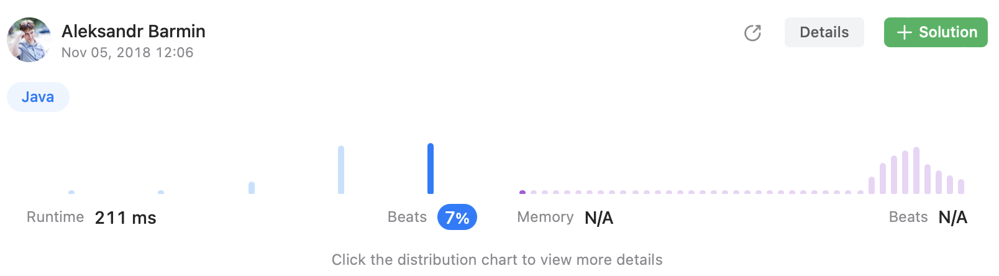
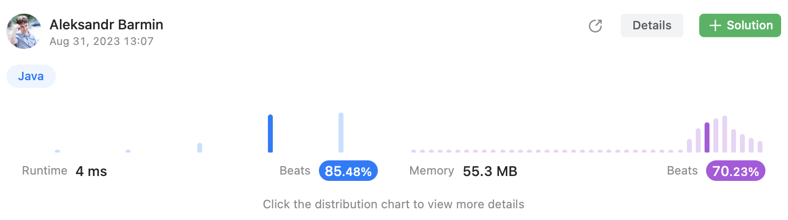

# Episode 11 - Container with most water

⬅️ [Back to index](README.md)

## The task

You are given an integer array height of length n. There are n vertical lines drawn such that the two endpoints of the ith line are (i, 0) and (i, height[i]).

Find two lines that together with the x-axis form a container, such that the container contains the most water. Return the maximum amount of water a container can store.

Notice that you may not slant the container.

Example: 

```
Input: height = [1,8,6,2,5,4,8,3,7]
Output: 49
```

## Suboptimal solution

Brute force approach is to iterate twice over all the heights and find a rectangle with the maximum area. 

```java
class Solution {
    public int maxArea(int[] height) {
        int result = 0;
        for (int i = 0; i < height.length - 1; i++) {
            for (int j = i; j < height.length; j++) {
                int area = getArea(i, height[i], j, height[j]);
                if (area > result) {
                    result = area;
                }
            }
        }
        return result;
    }
    
    private int getArea(int x1, int y1, int x2, int y2) {
        return Math.min(y1, y2) * Math.abs(x2 - x1);
    }
}
```

This approach works but it is not very good from performance perspective so that beats only 7% of other submissions. 



## Optimal solution

The main disadvantage of this approach is the fact that it has high complexity - O(n ^ 2) as it is necessary to iterate over all the heights twice. 

Let's make an assumption that a rectangle with larger base will have bigger area so will arrange two pointers to the most left and the most right elements of the array. Next these two pointers should move towards each other in a way that if height of the left element is more than height of the right element, the right pointer moves to the left hand side and visa versa. 

```java
class Solution {
    public int maxArea(int[] height) {
        int result = 0;
        int left = 0; 
        int right = height.length - 1; 
        while (left < right) {
            result = Math.max(result, getArea(left, right, height[left], height[right]));
            if (height[left] > height[right]) {
                right--;
            } else {
                left++;
            }
        }
        return result; 
    }

    private int getArea(final int x1, final int x2, final int y1, final int y2) {
        return Math.min(y1, y2) * Math.abs(x1 - x2);
    }
}
```

This approach gracefully beats majority of others. 

