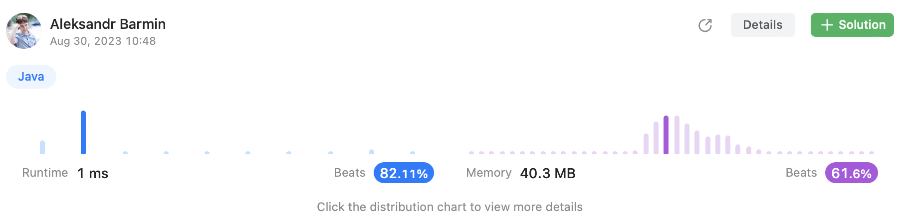

# Episode 14 - Longest Common Prefix

⬅️ [Back to index](README.md)

## The task

Write a function to find the longest common prefix string amongst an array of strings.
If there is no common prefix, return an empty string "".

## The solution

The idea is simple - need to select the first string from `strs` array and go through its characters one by one. If all other strings have the same next character then add the character to the prefix string. 

```java
class Solution {
    public String longestCommonPrefix(String[] strs) {
        final StringBuilder builder = new StringBuilder();
        final String first = strs[0];
        for (int i = 0; i < first.length(); i++) {
            boolean allMatch = true; 
            final char targetChar = first.charAt(i);
            for (int j = 0; j < strs.length; j++) {
                final String next = strs[j];
                if (next.length() - 1 < i) {
                    allMatch = false;
                    break; 
                }
                if (next.charAt(i) != targetChar) {
                    allMatch = false; 
                    break; 
                }
            }
            if (allMatch) {
                builder.append(targetChar);
            } else {
                break; 
            }
        }
        return builder.toString();
    }
}
```

