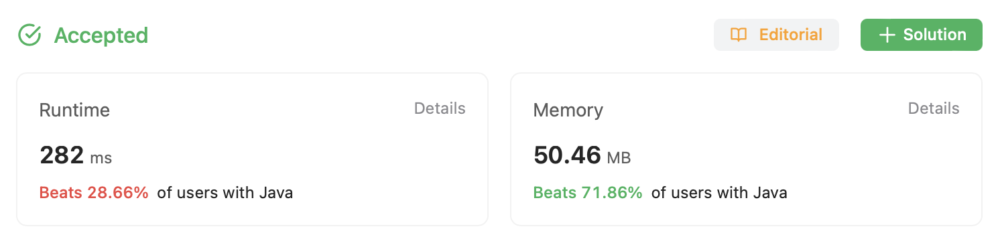
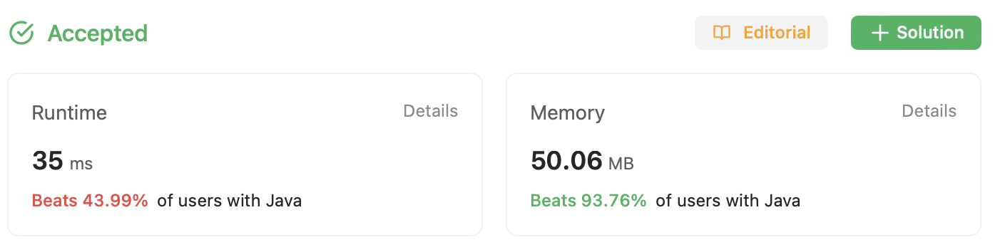

# Episode - Template

⬅️ [Back to index](README.md)

## The task

[Challenge on LeetCode](https://leetcode.com/problems/3sum/)

Given an integer array nums, return all the triplets [nums[i], nums[j], nums[k]] such that i != j, i != k, and j != k, and nums[i] + nums[j] + nums[k] == 0.

Notice that the solution set must not contain duplicate triplets.

Example: 

```
Input: nums = [-1,0,1,2,-1,-4]
Output: [[-1,-1,2],[-1,0,1]]
```

## Suboptimal solution

The easiest option is to have three nested loops. This is a working brute-force approach but it requires O(n ^ 3) time. Let's see how it may look like: 

```java
class Solution {
    public List<List<Integer>> threeSum(int[] nums) {
        final Set<List<Integer>> result = new HashSet<>();

        for (int i = 0; i < nums.length - 2; i++) {
            for (int j = i + 1; j < nums.length - 1; j++) {
                for (int k = j + 1; k < nums.length; k++) {
                    final int sum = nums[i] + nums[j] + nums[k];
                    if (sum == 0) {
                        final List<Integer> item = new ArrayList<>();
                        item.add(nums[i]);
                        item.add(nums[j]);
                        item.add(nums[k]);

                        // need to do that to avoid duplicates
                        Collections.sort(item);
                        result.add(item);
                    }
                }
            }
        }

        return new ArrayList(result); 
    }
}
```

This approach works, event passes basic test cases but still it will fail if you submit it. The error is expected - Time Limit Exceed. 

## Optimal solution

The better sould would be to sort the `nums` array first and next use three pointers again but in a different way. The first pointer `i` will always go from the beginning of the array to index `nums.length - 2`. The second pointer `j` will always go from `i + 1` to the right hand side of the array - it will constantly crease. The third pointer `k` will start from the last one index `nums.length - 1` and will always go to the left hand side. This will repeat while `j < k`. 

Pointer `i` always increments and starts a new iteration. Pointers `j` and `k` work slightly different. If the sum `nums[i] + nums[j] + nums[k]` is more than `0` it means that `k` should move one step left. At the same time, if the sum is less than `0`, the `j` pointer should take one step forward. 

```java
class Solution {
    public List<List<Integer>> threeSum(int[] nums) {
        Arrays.sort(nums);
        final Set<List<Integer>> result = new HashSet<>();

        for (int i = 0; i < nums.length - 2; i++) {
            int j = i + 1; 
            int k = nums.length - 1;
            while (j < k) {
                final int sum = nums[i] + nums[j] + nums[k];
                if (sum == 0) {
                    result.add(List.of(
                        nums[i], 
                        nums[j], 
                        nums[k]
                    ));
                    j++;
                    k--;
                } else if (sum > 0) {
                    k--;
                } else {
                    j++;
                }
            }
        }

        return new ArrayList(result); 
    }
}
```

The solution is acceptable and good enough: 



Because the `nums` array is sorted, it may include duplicated values like `0, 0, 1, 1` and these duplicates should be skipped. To do so, let's add `while` loops. 

```diff
class Solution {
    public List<List<Integer>> threeSum(int[] nums) {
        Arrays.sort(nums);
        final Set<List<Integer>> result = new HashSet<>();

        for (int i = 0; i < nums.length - 2; i++) {
+           if (i > 0 && nums[i - 1] == nums[i]) {
+               continue; 
+           }
            int j = i + 1; 
            int k = nums.length - 1;
            while (j < k) {
                final int sum = nums[i] + nums[j] + nums[k];
                if (sum == 0) {
                    result.add(List.of(
                        nums[i], 
                        nums[j], 
                        nums[k]
                    ));
+                   while (j < nums.length - 1 && nums[j] == nums[j + 1]) j++;
+                   while (k > 0 && nums[k] == nums[k - 1]) k--;

                    j++;
                    k--;
                } else if (sum > 0) {
                    k--;
                } else {
                    j++;
                }
            }
        }

        return new ArrayList(result); 
    }
}
```

This simple twick gives us a bit better performance. 

