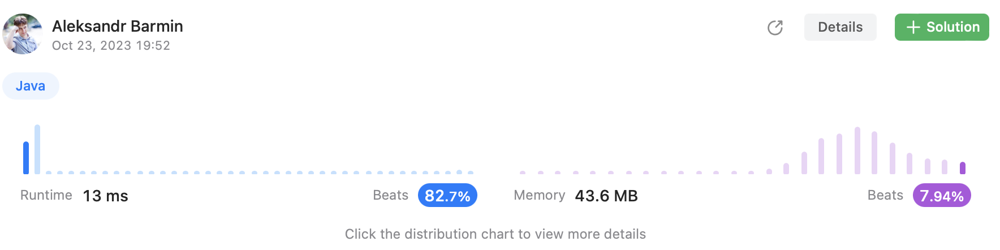

# Episode 16 - 3Sum Closest

⬅️ [Back to index](README.md)

## The task

[Challenge on LeetCode](https://leetcode.com/problems/3sum-closest/)

Given an integer array nums of length n and an integer target, find three integers in nums such that the sum is closest to target.

Return the sum of the three integers.

You may assume that each input would have exactly one solution.

## Suboptimal solution

Well, the task is really similar to [3Sum](./e15-3sum.md) but it seems it is a common scenario when it is necessary to find numbers closer to the `target` rather than to `0`. Okay, let's start with the simples possible solution - three nested loops: 

```java
class Solution {
    public int threeSumClosest(int[] nums, int target) {
        Arrays.sort(nums);
        int result = nums[0];
        int diff = Integer.MAX_VALUE;
        for (int i = 0; i < nums.length - 2; i++) {
            for (int j = i + 1; j < nums.length - 1; j++) {
                for (int k = j + 1; k < nums.length; k++) {
                    int part = nums[i] + nums[j] + nums[k];
                    if (Math.abs(part - target) < diff) {
                        result = part;
                        diff = Math.abs(part - target);
                    }
                }
            }
        }
        return result;
    }
}
```

This approach works and even passes all the test scenarios however beats only 7.69% other submissions. It seems, it is not the best approach possible. 

## Optimal solution

Let's assume, we'll use the same approach with three points: the first pointer `i` points to the most left element, pointer `j` starts from `i + 1` and always goes to the right hand side, and the last one pointer `k` starts with `nums.length - 1` and goes left until `j < k`. 

```java
class Solution {
    public int threeSumClosest(int[] nums, int target) {
        Arrays.sort(nums);
        int result = nums[0] + nums[1] + nums[2];

        for (int i = 0; i < nums.length - 2; i++) {
            int j = i + 1; 
            int k = nums.length - 1; 
            while (j < k) {
                final int sum = nums[i] + nums[j] + nums[k];
                if (sum == target) {
                    return sum; 
                } else if (Math.abs(sum - target) < Math.abs(result - target)) {
                    result = sum; 
                }
                if (sum > target) {
                    k--;
                } else {
                    j++;
                }
            }
        }

        return result; 
    }
}
```

This approach gives much better results and allows to beat 82.7 other submissions in Java!


