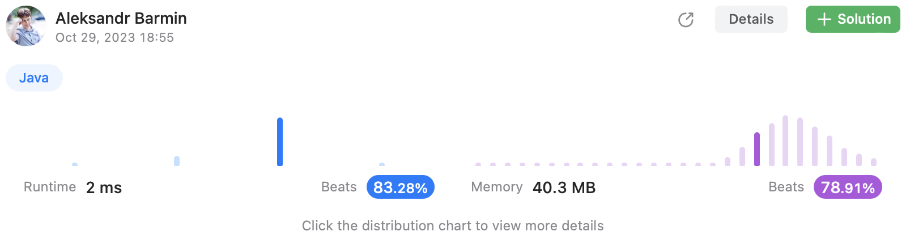
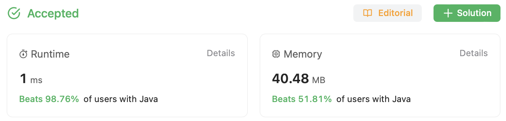

# Episode 20 - Valid Parentheses

⬅️ [Back to index](README.md)

## The task

Given a string s containing just the characters '(', ')', '{', '}', '[' and ']', determine if the input string is valid.

An input string is valid if:

* Open brackets must be closed by the same type of brackets.
* Open brackets must be closed in the correct order.
* Every close bracket has a corresponding open bracket of the same type.
 
Example:

```
Input: s = "()"
Output: true
```

## Suboptimal solution

Overall approach to such kind of challenges is to use a queue of added brackets - when an opening bracket is faced, it is added to the queue, when the closing bracket is faced - it is necessary to check if it is of the same type as the last one opening bracket and if so, remove both from the queue. 

Instead of adding both the brackets we may add only the closing one so that it is necessary to remove only the last one bracket from the queue. 

```java
class Solution {
    private final Map<Character, Character> mapping = Map.of(
        '(', ')', 
        '{', '}', 
        '[', ']'
    );

    public boolean isValid(String s) {
        if (s.length() % 2 == 1) {
            return false; 
        }
        final LinkedList<Character> buffer = new LinkedList<>();
        for (char c : s.toCharArray()) {
            final Character closing = mapping.get(c);
            if (closing == null && !buffer.isEmpty()) {
                // 'c' is a closing bracket, compare with the latest
                if (c != buffer.removeLast()) {
                    return false; 
                }    
            } else if (closing == null && buffer.isEmpty()) {
                // 
                return false; 
            } else {
                // it is an opening bracket, add the closing one
                buffer.add(closing);
            }
        }
        return buffer.isEmpty(); 
    }
}
```

The solution is good enough but still not perfect. 



## Optimal solution

We can improve this solution by removing the `Map` and replacing it with the hardcode as the task clearly states that only three types of brackets are supported. 

```java
class Solution {
    public boolean isValid(String s) {
        if (s.length() % 2 == 1) {
            return false; 
        }
        final LinkedList<Character> buffer = new LinkedList<>();
        for (char c : s.toCharArray()) {
            if (c == '(') {
                buffer.add(')');
            } else if (c == '{') {
                buffer.add('}');
            } else if (c == '[') {
                buffer.add(']');
            } else if (buffer.isEmpty() || c != buffer.removeLast()) {
                return false; 
            }
        }
        return buffer.isEmpty(); 
    }
}
```

Much better now!

